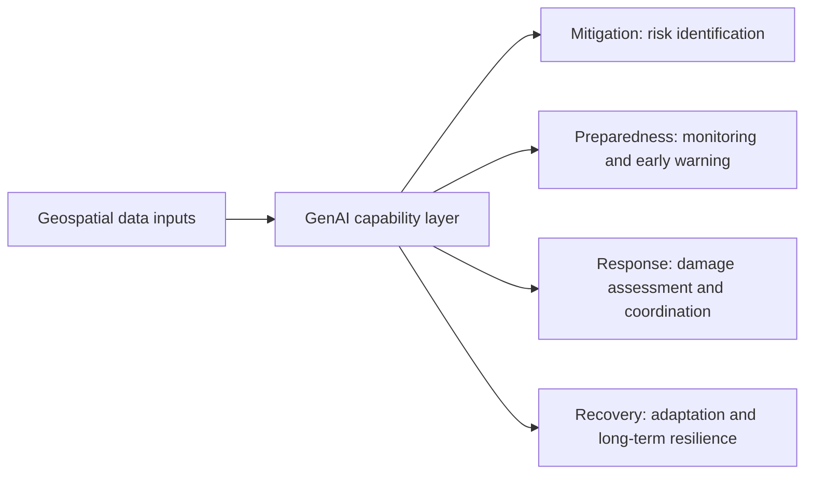
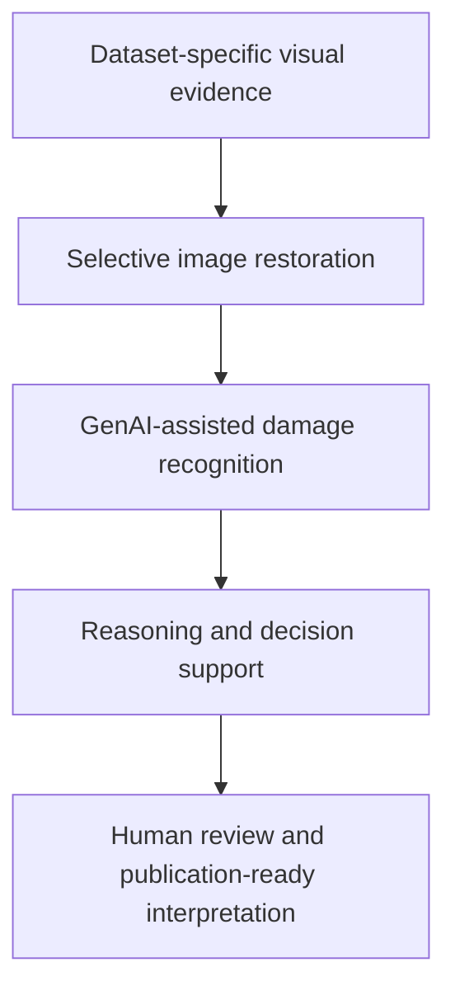

# GenAI4Dresilience

**Generative AI for Disaster Resilience**

[中文版](./README_zh.md)

> Publication-safe public companion repository. This repo shares only high-level concepts, public framing, and lightweight demonstrations while the related manuscript is under development. Detailed experiment results, raw data, prompts, model outputs, and unpublished figures are intentionally withheld until publication.

---

## Overview

**GenAI4Dresilience** explores how generative AI can support disaster resilience across the full disaster-management lifecycle: mitigation, preparedness, response, and recovery.

The central idea is that GenAI should not be treated as a single image-generation or text-generation tool. In disaster resilience, its value comes from combining four capabilities:

| Capability | Public-Safe Role in Disaster Resilience |
|---|---|
| Generation | Scenario construction, data completion, and option exploration |
| Multimodal perception | Linking remote sensing, street-view imagery, sensors, infrastructure records, and text reports |
| Reasoning | Turning heterogeneous evidence into interpretable risk, damage, and recovery rationales |
| Multi-agent collaboration | Representing coordination among agencies, infrastructure operators, planners, and communities |

Together, these capabilities support a shift from isolated perception tasks toward evidence synthesis, scenario reasoning, and decision support.

---

## Lifecycle Framework

The public framework maps GenAI capabilities to four resilience phases:




The framework emphasizes a phase-specific view:

- **Mitigation:** use counterfactual and scenario reasoning to identify where future losses may concentrate.
- **Preparedness:** convert heterogeneous monitoring streams into evolving situation models and warning rationales.
- **Response:** connect visual evidence with severity assessment, prioritization, and role-specific emergency decisions.
- **Recovery:** support option generation, trade-off analysis, and participatory planning for long-term resilience.

---

## Public Case Study Direction

The ongoing case study focuses on hurricane damage assessment with two complementary evidence settings:

- **Cross-view evidence:** post-disaster street-view imagery paired with post-disaster remote sensing imagery at matched locations.
- **Bi-temporal evidence:** pre- and post-disaster street-view imagery from the same local area.

The public workflow is summarized at a high level:



This repo does **not** release unpublished damage scores, sample imagery, evaluation tables, full prompts, or model-generated reports. Those materials will be shared only when they are appropriate for publication or reproducible release.

For a longer public-safe summary, see [docs/public_overview.md](./docs/public_overview.md).

---

## Repository Structure

```text
GenAI4Dresilience/
├── docs/
│   └── public_overview.md        # Publication-safe research summary
├── figure/
│   ├── framework.png             # Public conceptual framework
│   └── readme.md
├── code/
│   ├── README
│   └── map.py                    # Lightweight hurricane location visualization
├── README.md
└── README_zh.md
```

---

## Demo: Hurricane Location Visualization

`code/map.py` provides a lightweight public visualization of Hurricane Ian and Hurricane Milton locations over Florida. It is a demonstration script only and does not contain the unpublished analysis pipeline.

**Dependencies**

```bash
pip install matplotlib cartopy
```

**Run**

```bash
python code/map.py
```

---

## Disclosure Policy

To protect the ongoing manuscript, this repository currently avoids releasing:

- raw or derived image samples used in the case study
- detailed restoration, recognition, and reasoning prompts
- quantitative results and evaluation tables beyond public summaries
- intermediate model outputs or generated disaster reports
- complete experimental code for reproducing unpublished findings

After publication, this repository may be expanded with reproducible materials, citation information, and a clearer release package.

---

## Related Projects

| Project | Description |
|---|---|
| [Agent4Disaster](https://github.com/rayford295/Agent4Disaster) | Multi-agent GeoAI pipeline for disaster perception and reasoning |
| [Sat2Street-DisasterGen](https://github.com/rayford295/Sat2Street-DisasterGen) | Satellite-to-street-view synthesis for post-disaster assessment |
| [DamageArbiter](https://github.com/rayford295/DamageArbiter) | CLIP-enhanced multimodal hurricane damage assessment |
| [Bi-Temporal-StreetView](https://github.com/rayford295/Bi-Temporal-StreetView) | Hyperlocal damage assessment via bi-temporal street-view imagery |
| [DisasterVLP](https://github.com/rayford295/DisasterVLP) | Vision-language models for multidimensional disaster damage perception |

---

## Contact

**Yifan Yang** - Texas A&M University

- GitHub: [@rayford295](https://github.com/rayford295)
- Email: yyang295@tamu.edu
