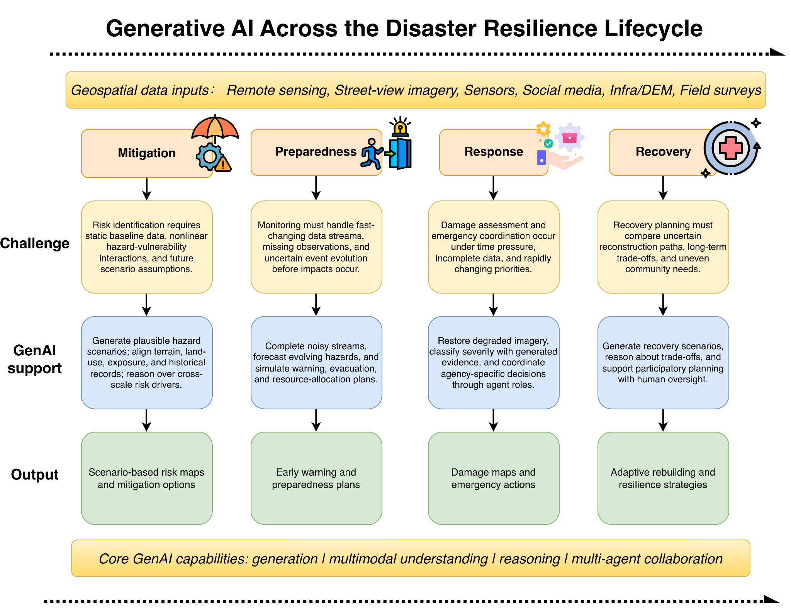
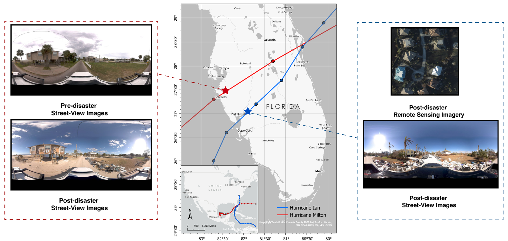
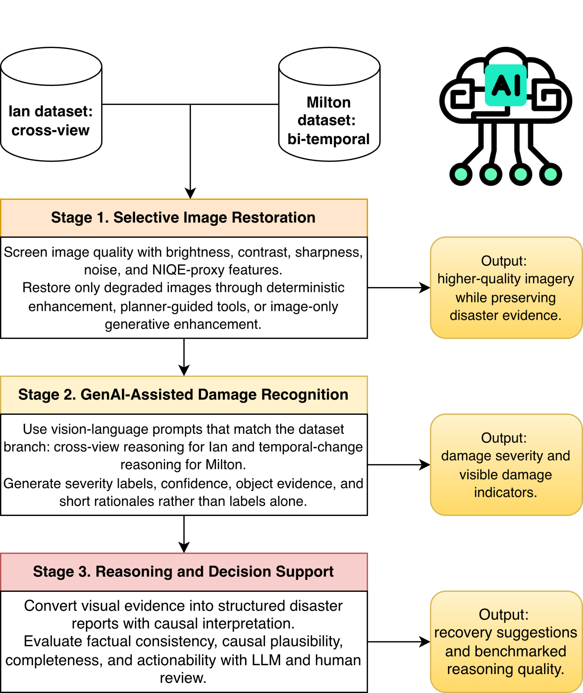
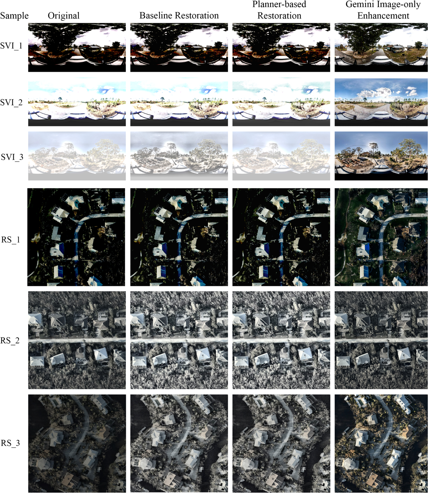
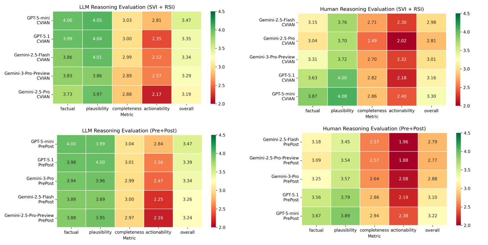
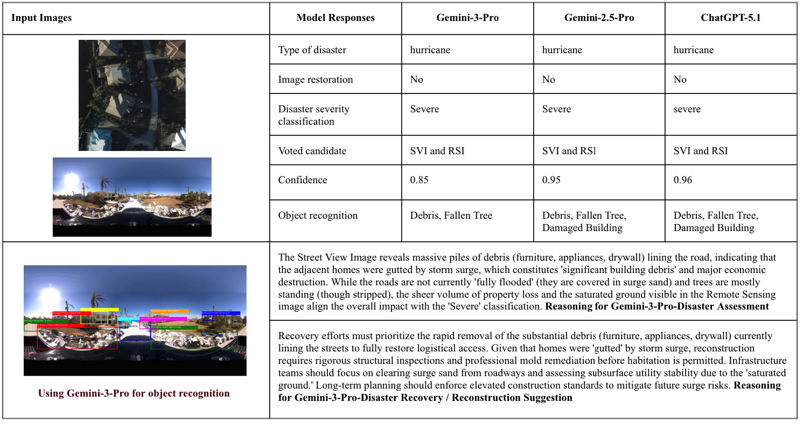

# GenAI4Dresilience

**Generative AI for Disaster Resilience**

Companion repository for the book chapter *Generative AI for Disaster Resilience*, submitted to
**Geography in the Age of Generative AI: Innovations in Mapping, Analysis & Geospatial Applications**
(CRC Press / Taylor & Francis Group), co-edited by Drs. Gengchen Mai (UT Austin), Xiao Huang (Emory),
Devika Jain (Harvard), and Dalton Lunga (ORNL).

> 📦 **Datasets:** [disaster-crossview-datasets](https://github.com/Rayford-AI/disaster-crossview-datasets) — the shared cross-view disaster data backbone for the Rayford-AI org.
> 🇨🇳 A short Chinese reading aid is available in [README_zh.md](./README_zh.md); this English README is authoritative.

---

## Authors

| Author | ORCID |
|---|---|
| Yifan Yang | [0009-0009-9496-6925](https://orcid.org/0009-0009-9496-6925) |
| Lei Zou | [0000-0001-6206-3558](https://orcid.org/0000-0001-6206-3558) |
| Hao Tian | [0009-0003-4564-8185](https://orcid.org/0009-0003-4564-8185) |
| Bing Zhou | [0000-0003-1106-1370](https://orcid.org/0000-0003-1106-1370) |
| Joynal Abedin | [0000-0001-6203-0959](https://orcid.org/0000-0001-6203-0959) |
| Zongrong Li | [0009-0008-0933-6439](https://orcid.org/0009-0008-0933-6439) |
| Zhengzhong Tu | [0000-0002-7594-2292](https://orcid.org/0000-0002-7594-2292) |

---

## Abstract

Generative artificial intelligence (GenAI) has shown promising progress in content generation, multimodal understanding, and reasoning, presenting new opportunities for disaster resilience research and practice. Disaster resilience refers to the capacity of socio-ecological-infrastructural systems to withstand, adapt to, recover from, and maintain continuous or improved operation in the face of disasters. It can be strengthened through actions in the four phases of emergency management: mitigation, preparedness, response, and recovery.

This chapter proposes a framework that systematically elaborates on the potential applications of incorporating GenAI into different resilience-improvement tasks. Using two recent hurricanes in Florida, USA, as examples, it also demonstrates the use of GenAI in processing multi-source geospatial data, including remote sensing and street-view imagery, for fine-grained disaster damage assessment. Finally, the chapter discusses key challenges and outlines future directions for the deeper integration of GenAI in building a resilient future.

---

## 1. Lifecycle Framework

The chapter places GenAI as a cross-cutting analytical and decision-support layer that combines **generation**, **multimodal understanding**, **reasoning**, and **multi-agent collaboration** with heterogeneous geospatial data across the four phases of disaster management. The four phases form a connected cycle: information generated during response and recovery strengthens future mitigation and preparedness. Human oversight and validation remain essential throughout.



*Figure 1. A lifecycle-oriented mapping framework of generative AI capabilities for disaster resilience.*

| Phase | Core challenge | What GenAI adds | Products | Key safeguard |
|---|---|---|---|---|
| **Mitigation** | Losses must be estimated before damage is observable; archives under-represent rare, compound, and cascading hazards | Connect heterogeneous evidence, explore counterfactual scenarios, explain consequences of alternative interventions | Scenario-based risk maps, transparent summaries of risk drivers, mitigation alternatives | Preserve provenance; separate observed, modeled, and synthetic evidence; expert and stakeholder validation |
| **Preparedness** | The political economy of false alarms; streams with different latencies, resolutions, and credibility | Maintain a coherent situation model, fill bounded data gaps, present forecasts with explicit uncertainty, rehearse multi-agency interactions | Early warnings and preparedness plans with rationales | Auditability under time pressure; decision protocols; humans remain accountable for public warnings |
| **Response** | Hours-scale decisions on incomplete, spatially biased evidence; cross-view alignment | Align satellite, aerial, and ground-level evidence; bounded generative reconstruction; severity assessments with evidence chains; role-based agents for coupled response tasks | Damage maps and emergency actions | Traceable and contestable outputs; field-verification protocols; life-critical decisions stay with accountable humans |
| **Recovery** | Institutional incentives favor rapid restoration over risk-informed transformation; uneven recovery trajectories | Track recovery indicators across modalities, construct alternative rebuilding pathways, make trade-offs explicit, simulate stakeholder negotiations | Adaptive rebuilding and resilience strategies | Report distributional effects, not averages; simulated stakeholders never replace real participation |

Detailed phase-by-phase discussion: [docs/lifecycle_framework.md](./docs/lifecycle_framework.md).

---

## 2. Case Study: GenAI for Hurricane Damage Assessment

### 2.1 Datasets

Two related but distinct datasets from Florida hurricanes are used. Labels were harmonized into a unified three-level scale (minor / moderate / severe).



*Figure 2. Study area and multimodal data examples for Hurricane Ian (2022) and Hurricane Milton (2024).*

| Dataset | Data type | Samples | Source |
|---|---|---|---|
| **A. Ian (2022)** | Post-disaster street-view + post-disaster remote sensing image pairs (cross-view) | 300 | CVDisaster (H. Li et al., 2025) |
| **B. Milton (2024)** | Pre- and post-disaster street-view image pairs (bi-temporal) | 300 | BiTemporal (Yang et al., 2025) |

### 2.2 Workflow

The case study maps three GenAI capabilities onto a three-stage, end-to-end workflow.



*Figure 3. Dataset-specific GenAI workflow for hurricane damage assessment, recognition, and decision support.*

**Stage 1 — Selective image restoration.** No-reference image quality assessment (IQA) features (brightness statistics, dark/bright pixel proportions, Laplacian variance, a noise proxy, and a NIQE-inspired metric) screen each image; only images below quality thresholds are restored. Three branches are compared: a heuristic baseline, a Gemini-based planner that selects a constrained deterministic toolchain, and an image-only Gemini enhancement. Effectiveness is measured with a composite quality score

$$Q = 0.4\,C + 0.4\,S + 0.2\,N \qquad (1)$$

where C, S, N are normalized contrast, sharpness, and NIQE-proxy terms. A restored output is accepted only if its score exceeds the original by a preset margin.

**Stage 2 — GenAI-assisted damage recognition.** Vision-language models (VLMs) output an overall severity level, a confidence score, and binary visibility labels for five indicators: debris, fallen trees, flooded roads, damaged buildings, downed lines. Cross-view inputs (Ian) are processed jointly; bi-temporal inputs (Milton) are compared for change. Severity prediction is evaluated with accuracy and the ordinal-aware **Normalized Cross-Severity Error**

$$\mathrm{NCSE} = \frac{1}{N}\sum_{i=1}^{N} \frac{|y_i - \hat{y}_i|}{K-1} \qquad (2)$$

which ranges from 0 (perfect) to 1 and penalizes large severity gaps more than adjacent confusions.

**Stage 3 — Reasoning and decision support.** Models produce structured disaster reports with causal interpretation and recovery recommendations. Reports are scored on a 0–5 Likert scale along four dimensions (factual consistency, causal plausibility, information completeness, actionability) by an LLM judge (GPT-5.2) and by three graduate-student evaluators.

### 2.3 Results

#### Image restoration (Table 2)

| Dataset | Image type | Total | Restored | Q_original | Q_baseline | Q_planner | Q_gemini |
|---|---|---|---|---|---|---|---|
| A. Ian | Satellite | 150 | 141 | 0.62 | **0.73** | 0.71 | 0.69 |
| A. Ian | SVI | 150 | 22 | 0.75 | 0.78 | 0.76 | **0.79** |
| B. Milton | SVI | 150 | 4 | 0.76 | 0.78 | 0.78 | **0.79** |

Baseline and planner branches are more stable across heterogeneous imagery; the Gemini image-only branch gives stronger gains on some street-view scenes but with higher variability.



*Figure 4. Visual comparison of restoration outputs across baseline enhancement, planner-based restoration, and Gemini image-only optimization for SVI and RSI samples.*

#### Severity classification (Table 3)

| Model | Acc. (Ian) | Acc. (Milton) | NCSE (Ian) ↓ | NCSE (Milton) ↓ |
|---|---|---|---|---|
| GPT-5.1-mini | 0.387 | 0.503 | 0.307 | 0.248 |
| GPT-5.1 | 0.573 | **0.591** | 0.213 | **0.218** |
| Gemini-2.5-Flash | 0.360 | 0.470 | 0.363 | 0.299 |
| Gemini-2.5-Pro | 0.380 | 0.447 | 0.373 | 0.327 |
| Gemini-3-Pro | **0.627** | 0.493 | **0.190** | 0.291 |

In both datasets the most accurate model also has the lowest NCSE. Gemini-3-Pro leads on cross-view data; GPT-5.1 leads on bi-temporal data.

#### Damage-indicator recognition (Tables 4 and 5)

| Dataset | Model | F1 | Recall | Precision | Accuracy |
|---|---|---|---|---|---|
| A. Ian | **Gemini-3-Pro** | **0.774** | 0.784 | **0.799** | **0.925** |
| A. Ian | Gemini-2.5-Pro | 0.573 | **0.914** | 0.503 | 0.716 |
| A. Ian | Gemini-2.5-Flash | 0.554 | 0.814 | 0.540 | 0.747 |
| A. Ian | GPT-5.1 | 0.547 | 0.584 | 0.643 | 0.840 |
| A. Ian | GPT-5.1-mini | 0.497 | 0.579 | 0.465 | 0.795 |
| B. Milton | Gemini-3-Pro | 0.391 | 0.357 | 0.512 | 0.847 |
| B. Milton | Gemini-2.5-Pro | 0.427 | 0.468 | 0.398 | 0.789 |
| B. Milton | Gemini-2.5-Flash | 0.435 | 0.439 | 0.433 | 0.831 |
| B. Milton | **GPT-5.1** | **0.553** | **0.540** | **0.571** | **0.955** |
| B. Milton | GPT-5.1-mini | 0.466 | 0.486 | 0.450 | 0.861 |

Per-indicator scores (Table 5) are in [results/table5_indicator_recognition_per_class.csv](./results/table5_indicator_recognition_per_class.csv). Gemini-3-Pro is strongest on Ian for building damage (0.94), power lines (1.00), and fallen trees (0.92); GPT-5.1 is best across all categories on Milton (buildings 0.97, debris 0.92, power lines 1.00, flooded areas 0.99). No single model dominates every condition.

#### End-to-end disaster report generation



*Figure 5. Generative AI-based disaster report generation from multimodal observations.*



*Figure 6. LLM and human evaluation of multimodal disaster reasoning.*

Factual consistency and causal plausibility are high (mostly above 4.0). Actionability is consistently the weakest dimension (typically 2.0–2.8), exposing a gap between descriptive reasoning and decision-oriented recommendations. LLM-based scores track human judgments, and cross-view inputs yield more complete reports than bi-temporal inputs.

Full case-study write-up: [docs/case_study.md](./docs/case_study.md). Machine-readable tables: [results/](./results/).

---

## 3. Challenges and Opportunities

The chapter frames future work along three complementary dimensions:

- **Responsibility.** Incomplete and biased disaster data, hallucination, and opacity threaten trust in high-stakes settings. Responsible GenAI frameworks need transparency, uncertainty quantification, explainability, and governance for privacy and fairness.
- **Autonomy.** Generation, perception, reasoning, and multi-agent collaboration point toward adaptive disaster-intelligence systems, but autonomy must stay reliable under uncertainty, aligned with domain expertise, and under controllable human oversight.
- **Equity.** Compute and API costs mean the regions most exposed to risk are least able to benefit. Cross-border data-sovereignty barriers further limit transnational response. Remedies include lightweight, locally deployable models, open-access initiatives, and coordinated data-sharing governance.

Together these point toward an AI-native disaster-resilience paradigm in which GenAI is an accountable component of the disaster-management ecosystem rather than a standalone tool. See [docs/challenges_and_outlook.md](./docs/challenges_and_outlook.md).

---

## Repository Structure

```text
GenAI4Dresilience/
├── docs/
│   ├── lifecycle_framework.md     # Section 2: GenAI across mitigation, preparedness, response, recovery
│   ├── case_study.md              # Section 3: datasets, methodology, results
│   ├── challenges_and_outlook.md  # Section 4: responsibility, autonomy, equity
│   └── references.md              # Chapter reference list
├── figure/
│   ├── fig1_lifecycle_framework.png
│   ├── fig2_study_area_and_data.png
│   ├── fig3_case_study_workflow.png
│   ├── fig4_restoration_comparison.png
│   ├── fig5_disaster_report_example.png
│   ├── fig6_reasoning_evaluation.png
│   └── readme.md
├── results/                       # Tables 1–5 as CSV
├── code/
│   └── map.py                     # Hurricane Ian / Milton location map (Figure 2 base)
├── CITATION.cff
├── README.md
└── README_zh.md                   # Chinese reading aid
```

---

## Demo: Hurricane Location Visualization

`code/map.py` draws the Hurricane Ian and Hurricane Milton study locations over Florida.

```bash
pip install matplotlib cartopy
python code/map.py
```

---

## Release Notes

This repository shares the chapter's framework, figures, evaluation tables, and metric definitions. Model prompts, raw model outputs, and restoration/evaluation pipeline code are not yet released; they will be added once the chapter is published. Source imagery follows the licenses of the CVDisaster and BiTemporal datasets.

---

## Citation

```bibtex
@incollection{yang2026genai4dresilience,
  title     = {Generative AI for Disaster Resilience},
  author    = {Yang, Yifan and Zou, Lei and Tian, Hao and Zhou, Bing and Abedin, Joynal and Li, Zongrong and Tu, Zhengzhong},
  booktitle = {Geography in the Age of Generative AI: Innovations in Mapping, Analysis \& Geospatial Applications},
  editor    = {Mai, Gengchen and Huang, Xiao and Jain, Devika and Lunga, Dalton},
  publisher = {CRC Press / Taylor \& Francis Group},
  year      = {2026},
  note      = {Submitted}
}
```

---

## Related Projects

| Project | Description |
|---|---|
| [Agent4Disaster](https://github.com/rayford295/Agent4Disaster) | Multi-agent GeoAI pipeline for disaster perception and reasoning |
| [Sat2Street-DisasterGen](https://github.com/rayford295/Sat2Street-DisasterGen) | Satellite-to-street-view synthesis for post-disaster assessment |
| [DamageArbiter](https://github.com/rayford295/DamageArbiter) | CLIP-enhanced multimodal hurricane damage assessment |
| [Bi-Temporal-StreetView](https://github.com/rayford295/Bi-Temporal-StreetView) | Hyperlocal damage assessment via bi-temporal street-view imagery (Dataset B source) |
| [DisasterVLP](https://github.com/rayford295/DisasterVLP) | Vision-language models for multidimensional disaster damage perception |

---

## Contact

**Yifan Yang** — Texas A&M University

- GitHub: [@rayford295](https://github.com/rayford295)
- Email: yyang295@tamu.edu
