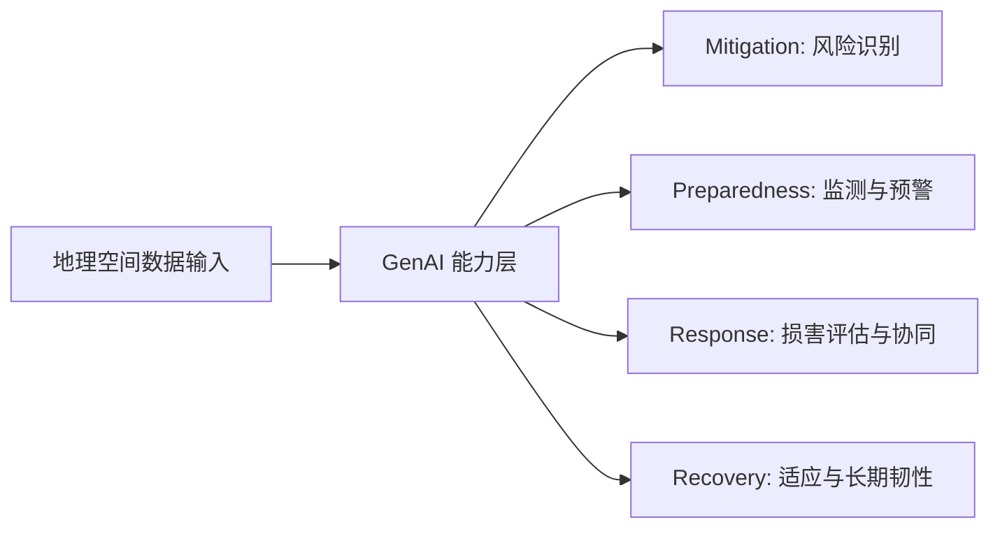
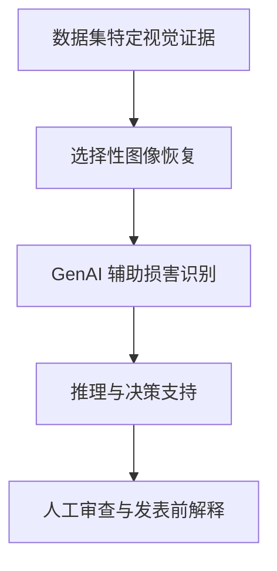

# GenAI4Dresilience

**生成式人工智能用于灾害韧性**

[English Version](./README.md)

> 这是一个面向公开展示的论文 companion repository。由于相关论文仍在准备和投稿前阶段，本仓库目前只展示高层概念、公开安全的研究框架和轻量演示，不公开实验结果、原始数据、prompt、模型输出和未发表核心图表。

---

## 项目简介

**GenAI4Dresilience** 探索生成式人工智能如何支持灾害管理全生命周期中的韧性任务，包括 mitigation、preparedness、response 和 recovery。

本项目的核心思想是：GenAI 不应被简单理解为单一的图像生成或文本生成工具。在灾害韧性研究中，它的价值来自四类能力的结合：

| 能力 | 面向公开展示的作用 |
|---|---|
| Generation | 情景构建、数据补全和方案探索 |
| Multimodal perception | 连接遥感、街景、传感器、基础设施记录和文本报告 |
| Reasoning | 将异构证据转化为可解释的风险、损害和恢复推理 |
| Multi-agent collaboration | 表征机构、基础设施运营者、规划者和社区之间的协同 |

这些能力共同推动灾害分析从单点感知任务走向证据综合、情景推理和决策支持。

---

## 生命周期框架

公开版本框架将 GenAI 能力映射到四个灾害韧性阶段：




框架强调不同阶段的任务差异：

- **Mitigation:** 使用反事实和情景推理识别未来损失可能集中的区域。
- **Preparedness:** 将多源监测流转化为动态态势模型和预警解释。
- **Response:** 将视觉证据连接到损害等级、响应优先级和机构任务。
- **Recovery:** 支持恢复方案生成、权衡分析和参与式长期韧性规划。

---

## 公开案例研究方向

正在推进的案例研究关注飓风损害评估中的两类视觉证据：

- **Cross-view evidence:** 同一位置的灾后街景图像与灾后遥感图像。
- **Bi-temporal evidence:** 同一局部区域的灾前和灾后街景图像。

公开版本仅概括高层 workflow：



本仓库目前**不会**公开未发表的损害评分、样本图像、评估表格、完整 prompt 或模型生成报告。相关材料会在适合发表或复现发布时再补充。

更多公开安全的研究说明见 [docs/public_overview.md](./docs/public_overview.md)。

---

## 仓库结构

```text
GenAI4Dresilience/
├── docs/
│   └── public_overview.md        # 公开安全的研究概述
├── figure/
│   ├── framework.png             # 公开概念框架图
│   └── readme.md
├── code/
│   ├── README
│   └── map.py                    # 轻量飓风位置可视化
├── README.md
└── README_zh.md
```

---

## 演示：飓风位置可视化

`code/map.py` 提供 Hurricane Ian 和 Hurricane Milton 在佛罗里达区域的轻量可视化。它只是公开演示脚本，不包含未发表分析 pipeline。

**依赖安装**

```bash
pip install matplotlib cartopy
```

**运行**

```bash
python code/map.py
```

---

## 公开边界

为了保护正在准备的论文，本仓库目前避免发布：

- 案例研究使用的原始或派生图像样本
- 图像恢复、损害识别和推理模块的详细 prompt
- 定量结果和完整评估表格
- 中间模型输出或生成式灾害报告
- 可复现未发表结果的完整实验代码

论文发表后，本仓库可以继续补充可复现材料、引用信息和正式 release package。

---

## 相关项目

| 项目 | 描述 |
|---|---|
| [Agent4Disaster](https://github.com/rayford295/Agent4Disaster) | 多智能体 GeoAI 灾害感知与推理流水线 |
| [Sat2Street-DisasterGen](https://github.com/rayford295/Sat2Street-DisasterGen) | 卫星图像合成街景用于灾后评估 |
| [DamageArbiter](https://github.com/rayford295/DamageArbiter) | 基于 CLIP 的多模态飓风损害评估框架 |
| [Bi-Temporal-StreetView](https://github.com/rayford295/Bi-Temporal-StreetView) | 双时相街景图像灾害损害评估 |
| [DisasterVLP](https://github.com/rayford295/DisasterVLP) | 视觉语言模型用于多维度灾害损害感知 |

---

## 联系方式

**杨一帆（Yifan Yang）** - 德克萨斯农工大学

- GitHub: [@rayford295](https://github.com/rayford295)
- 邮箱: yyang295@tamu.edu
