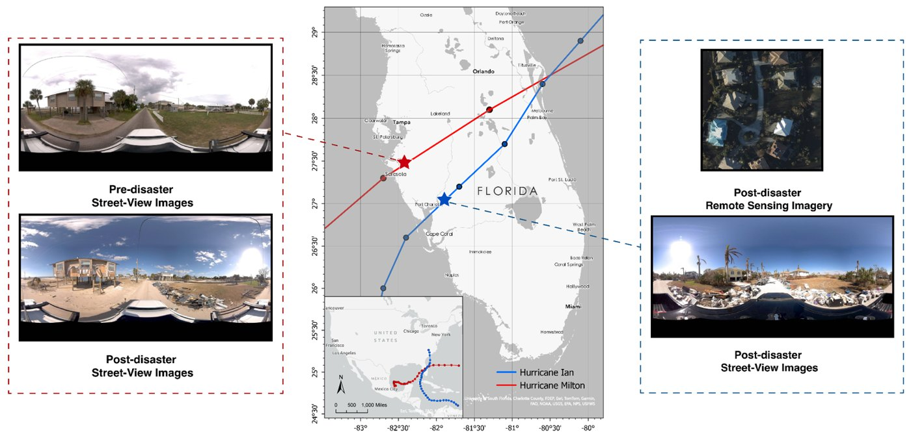
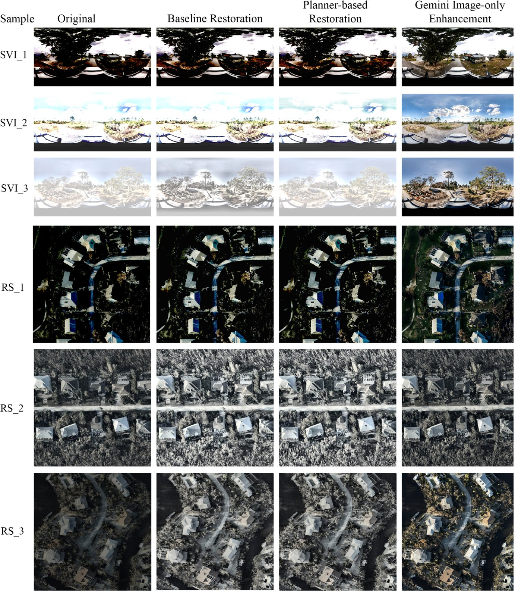
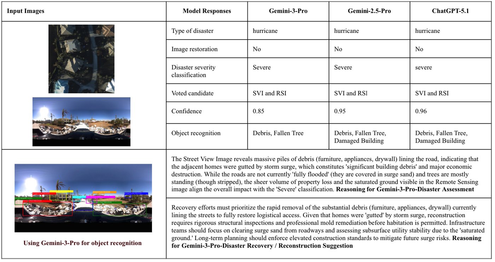

# Case Study: GenAI for Hurricane Damage Assessment

_Text from the chapter **Generative AI for Disaster Resilience** (Yang, Zou, Tian, Zhou, Abedin, Li, Tu), submitted to *Geography in the Age of Generative AI: Innovations in Mapping, Analysis & Geospatial Applications* (CRC Press / Taylor & Francis). Back to [README](../README.md)._

CSV versions of Tables 1–5 are in [`results/`](../results/).

### 3.1 Dataset

This section presents a case study on hyperlocal disaster damage assessment following two hurricanes in Florida, United States, using two related but distinct datasets. The 2022 Hurricane Ian dataset evaluates a cross-view task that pairs post-disaster street-view imagery with post-disaster remote sensing imagery at matched locations (H. Li et al., 2025). The 2024 Hurricane Milton dataset evaluates a bi-temporal street-view task that compares pre- and post-disaster street-view imagery from the same region (Yang et al., 2025). Because the two datasets use different visual evidence, this case study does not assume that every model input contains both remote-sensing and street-view imagery. Instead, it examines how GenAI contributes to three concrete steps: selective image restoration, VLM-based damage recognition with generated evidence, and reasoning-based report generation with recovery suggestions.

Figure 2 shows the study locations and sample images from the collected datasets. The Ian dataset comprises 300 pairs of post-disaster street-view images and post-disaster remote sensing imagery, whereas the Milton dataset comprises 300 pairs of pre- and post-disaster street-view images (Table 1). All samples were manually categorized by trained annotators into three damage severity levels based on visual assessments of structural damage and environmental impact. The Milton dataset from Yang et al. (2025) uses the labels mild, moderate, and severe, while the Ian dataset from H. Li et al. (2025) adopts light, medium, and heavy damage classifications. To ensure consistency across datasets, we harmonized these labels into a unified three-level severity scale: light/mild as minor damage, medium/moderate as moderate damage, and heavy/severe as severe damage.

*Figure 2. Study Area and Multimodal Data Examples for Hurricane Ian (2022) and Hurricane Milton (2024)*

*Table 1. Composition and Characteristics of the Multimodal Hurricane Damage Datasets*

| Dataset | Data Type | Sample Size (Images) | Source |
|---|---|---|---|
| Dataset A. Ian (2022) | Post-disaster street-view and remote sensing image pairs | 300 | CVDisaster (H. Li et al., 2025) |
| Dataset B. Milton (2024) | Pre- and post-disaster street-view image pairs | 300 | BiTemporal (Yang et al., 2025) |

### 3.2 Methodology

This case study develops a framework for identifying and evaluating hurricane damage from a GenAI perspective. The framework highlights three core capabilities underpinning GenAI: generative capability, multimodal understanding, and reasoning. These capabilities are mapped onto the disaster analysis workflow to form an end-to-end system that integrates data generation, information perception, and decision-making, as illustrated in Figure 3.

*Figure 3. Dataset-Specific GenAI Workflow for Hurricane Damage Assessment, Recognition, and Decision Support*

#### 3.2.1 Selective Image Restoration

This study addresses data completion and quality improvement in disaster scenarios using generative capabilities. Post-disaster imagery often suffers from blur, abnormal exposure, and missing regions, limiting its suitability for high-precision analysis. To mitigate these issues, we leverage VLMs with an image restoration module to enhance and reconstruct both street-view and remote sensing imagery. We compare baseline methods, planning-driven approaches, and generative optimization strategies. The generative approach consistently improves multiple image-quality metrics, yielding higher-quality inputs for downstream analysis. These results show that GenAI expands the data space through reconstruction, enabling the recovery of latent structures under incomplete observations.

More specifically, the method performs rapid screening using no-reference image quality assessment (IQA) features, including brightness statistics, proportions of dark and bright pixels, Laplacian variance, a noise proxy, and a simplified Naturalness Image Quality Evaluator (NIQE)-inspired metric. These features capture common degradations, such as low illumination, overexposure, low contrast, blur, noise, and haze. Based on these indicators, the system determines whether restoration is necessary. Only images that fall below predefined quality thresholds are processed, avoiding unnecessary restoration of high-quality usable inputs.

To provide a unified measure of restoration effectiveness across branches, we define a composite quality score Q based on three normalized components most directly related to downstream visual interpretability, as shown in Equation 1:

$$Q = 0.4\,C + 0.4\,S + 0.2\,N \qquad (1)$$

where C, S, and N represent normalized contrast, sharpness, and NIQE-proxy terms, respectively. Higher Q values indicate better image quality and greater visual suitability for downstream damage interpretation.

In the execution stage, the method evaluates three restoration branches. The first is a heuristic baseline branch that selects a single deterministic restoration tool based on the dominant defect type identified in the diagnostic stage. The second is a Gemini-based planner branch that uses image metadata and IQA features to recommend a constrained deterministic toolchain. The available operations are deliberately restricted to a small tool library, such as low-light enhancement, deblurring, dehazing, and low-resolution upsampling, to avoid one-size-fits-all enhancements and reduce the risk of introducing artifacts. The third is an image-only Gemini enhancement branch that directly produces a lightly enhanced version of the input scene, improving overall exposure, contrast, and texture visibility while preserving the original structure and content.

To prevent restoration from weakening disaster traces, over-smoothing structural details, or producing visually improved but semantically unreliable outputs, the system recalculates the composite quality score after each restoration branch and compares it with the original image. Here, Q_original is the quality score of the input image before any restoration, Q_baseline is the score after the heuristic baseline branch, Q_planner is the score after the planner-guided deterministic toolchain, and Q_gemini is the score after the image-only Gemini enhancement branch. These four scores provide a unified basis for evaluating restoration effectiveness across branches. A branch output is accepted only when its post-restoration score exceeds Q_original by at least a preset margin; otherwise, the original image is retained.

#### 3.2.2 GenAI-Assisted Damage Assessment and Recognition

This study develops a cross-view and multi-source fusion mechanism to enhance multimodal perception for disaster understanding. First, for cross-view hurricane data, the model jointly processes remote sensing imagery (RSI) and street-view imagery (SVI) from the same location. It outputs an overall damage level, a confidence score, and binary visibility labels for five visible damage indicators: debris, fallen trees, flooded roads, damaged buildings, and downed lines, under a unified mild/moderate/severe classification scheme. Second, for bi-temporal street-view imagery, the model compares pre-disaster (2023) and post-disaster (2024) images to capture visual changes and assess disaster impacts. It also performs object-level recognition on post-disaster images, enabling damage analysis along the temporal dimension.

VLMs enable automatic classification of disaster severity by jointly analyzing visual and semantic information. They identify disaster types, damage levels, and key objects, such as collapsed buildings, debris, and damaged power lines. The model also generates descriptive captions for street-view images to enhance semantic understanding.

We evaluate damage recognition as a multi-class severity prediction task using overall accuracy and a severity-aware metric, Normalized Cross-Severity Error (NCSE), which accounts for the ordinal structure of damage levels. Let y_i and ŷ_i ∈ {0, ..., K - 1} denote the ground-truth and predicted damage classes for the sample i, where larger values indicate more severe damage, and K is the number of ordered categories. NCSE is defined as

$$\mathrm{NCSE} = \frac{1}{N}\sum_{i=1}^{N} \frac{|y_i - \hat{y}_i|}{K-1} \qquad (2)$$

where N is the total number of samples. NCSE ranges from 0 (perfect agreement) to 1 (all predictions in the most distant class) and penalizes large severity gaps more strongly than confusions between adjacent categories.

#### 3.2.3 Reasoning and Decision Support

This study advances GenAI for disaster analysis from perception-based tasks to reasoning-driven decision-making. Unlike traditional classification models that assign labels, the proposed framework uses large models to produce structured interpretations and causal analyses of disaster scenarios. For example, when analyzing a severely damaged scene, the model not only identifies the extent of damage but also infers underlying causes from visual evidence, such as storm surge or debris accumulation. It further supports decision-making by proposing recovery actions, including clearing transportation routes and assessing infrastructure stability. These capabilities demonstrate how GenAI enables deeper semantic understanding and logical reasoning in complex spatial contexts, extending disaster analysis from detection to explanation and actionable decision-making.

This study developed a two-tiered quantitative evaluation framework that combines automated and human assessments. First, we introduced an LLM-based evaluation mechanism that automatically assesses generated disaster reports across multiple dimensions, including factual consistency, causal plausibility, information completeness, and the feasibility of recovery recommendations. GPT-5.2 was used as the evaluation model, and a Likert scale was applied to score each dimension in this case study. The average score across all dimensions was used as an overall indicator of reasoning quality. For human evaluation, three graduate students with expertise in disaster research independently assessed the system outputs using the same criteria. The final human evaluation score was computed as the average across the three evaluators.

### 3.3 Results

#### 3.3.1 Performance of GenAI in Disaster Image Restoration

Table 2 compares the performance of different GenAI models in restoring disaster-related images. Q_original denotes the pre-restoration quality score, and Q_baseline, Q_planner, and Q_gemini denote the post-restoration scores from the baseline, planner-guided, and Gemini image-only branches, respectively. Generally, GenAI improves the visual quality of post-disaster imagery, with the magnitude and ranking of improvements varying across image modalities and disaster contexts. For hurricane satellite imagery, the baseline and planner branches yield the largest gains, increasing the score from 0.62 to 0.73 and 0.71, respectively, while the Gemini branch reaches 0.69. For hurricane street-view imagery, the Gemini branch achieves the highest score in improving the quality of the post-Ian street-view images from 0.75 to 0.79. However, this advantage is not consistent across all street-view categories. Overall, the baseline and planner branches show more stable performance across heterogeneous disaster imagery, while the Gemini image-only branch delivers stronger gains in some street-view scenes but exhibits greater variability across categories.

*Table 2. Results of Image Restoration*

| Category | Total Images | Disaster Type | Image Type | Restored Images | Q_original | Q_baseline | Q_planner | Q_gemini |
|---|---|---|---|---|---|---|---|---|
| A. Ian Dataset | 150 | Hurricane | Satellite | 141 | 0.62 | 0.73 | 0.71 | 0.69 |
| A. Ian Dataset | 150 | Hurricane | SVI | 22 | 0.75 | 0.78 | 0.76 | 0.79 |
| B. Milton Dataset | 150 | Hurricane | SVI | 4 | 0.76 | 0.78 | 0.78 | 0.79 |

Figure 4 qualitatively compares restoration results across the three branches for both street-view and remote-sensing imagery. The visual patterns are consistent with Table 2. The Gemini branch enhances global exposure and texture visibility in street-view scenes, while the baseline and planner branches consistently improve haze reduction, contrast, and structural clarity in remote-sensing imagery. These results indicate that restoration performance is context-dependent and support an adaptive, multi-branch framework rather than a single uniform strategy.

*Figure 4. Visual comparison of restoration outputs across baseline enhancement, planner-based restoration, and Gemini image-only optimization for SVI and RSI samples.*
#### 3.3.2 Performance of GenAI in Disaster Damage Assessment

Table 3 compares the overall accuracy and NCSE of different GenAI models in the damage classification task across two hurricane datasets. Performance varies by dataset; however, in both cases, the model with the highest accuracy also achieves the lowest NCSE, indicating consistent improvements in both classification accuracy and severity-aware reliability. For Dataset A (2022 Hurricane Ian), which includes post-disaster street-view and remote-sensing image pairs, Gemini-3-Pro performs best, achieving an accuracy of 0.627 and the lowest NCSE of 0.190. For Dataset B (2024 Hurricane Milton), consisting of pre- and post-disaster street-view image pairs, GPT-5.1 achieves the highest accuracy (0.591) and the lowest NCSE (0.218), while other models exhibit higher severity errors despite similar accuracies.

*Table 3. Overall Performance and Cross-Severity Error of Different Models across Cross-View and Bi-Temporal Datasets*

| Metric | Model | A. Ian Dataset | B. Milton Dataset |
|---|---|---|---|
| Accuracy | GPT-5.1-mini | 0.387 | 0.503 |
| Accuracy | GPT-5.1 | 0.573 | 0.591 |
| Accuracy | Gemini-2.5-Flash | 0.360 | 0.470 |
| Accuracy | Gemini-2.5-Pro | 0.380 | 0.447 |
| Accuracy | Gemini-3-Pro | 0.627 | 0.493 |
| NCSE | GPT-5.1-mini | 0.307 | 0.248 |
| NCSE | GPT-5.1 | 0.213 | 0.218 |
| NCSE | Gemini-2.5-Flash | 0.363 | 0.299 |
| NCSE | Gemini-2.5-Pro | 0.373 | 0.327 |
| NCSE | Gemini-3-Pro | 0.190 | 0.291 |

Table 4 compares the overall performance of the selected GenAI models in recognizing the five damage indicators (damaged buildings, debris, downed power lines, fallen trees, and flooded areas) on two datasets. In Dataset A, Gemini-3-Pro achieves the best overall performance, with the highest F1-score (0.7741), precision (0.7988), and accuracy (0.9253). In contrast, Gemini-2.5-Pro and Gemini-2.5-Flash show higher recall but lower precision, indicating a tendency toward over-detection. The lightweight GPT-5.1-mini serves as a weak baseline with limited performance. In Dataset B, GPT-5.1 achieves the best overall performance, with the highest F1-score (0.55250), precision (0.57056), and accuracy (0.95540). The bi-temporal setting requires the model to infer disaster impact from visual changes, and GPT-5.1 demonstrates strong capability in capturing cross-temporal differences. In contrast, the Gemini-2.5 series shows moderate performance but remains weaker than GPT-5.1. GPT-5.1-mini serves as a stable, though weaker, baseline.

*Table 4. Quantitative Performance of Different Models on Disaster Damage Recognition across Cross-View and Bi-Temporal Datasets*

| Category | Model | F1-score | Recall | Precision | Accuracy |
|---|---|---|---|---|---|
| A. Ian Dataset | Gemini-3-Pro | 0.77412 | 0.78424 | 0.79884 | 0.92534 |
| A. Ian Dataset | Gemini-2.5-Pro | 0.57322 | 0.91448 | 0.50282 | 0.71602 |
| A. Ian Dataset | Gemini-2.5-Flash | 0.55374 | 0.81412 | 0.53964 | 0.74666 |
| A. Ian Dataset | GPT-5.1 | 0.54746 | 0.58398 | 0.64264 | 0.84000 |
| A. Ian Dataset | GPT-5.1-mini | 0.49698 | 0.57854 | 0.46454 | 0.79468 |
| B. Milton Dataset | Gemini-3-Pro | 0.39096 | 0.35676 | 0.51210 | 0.84688 |
| B. Milton Dataset | Gemini-2.5-Pro | 0.42680 | 0.46812 | 0.39818 | 0.78924 |
| B. Milton Dataset | Gemini-2.5-Flash | 0.43492 | 0.43934 | 0.43284 | 0.83108 |
| B. Milton Dataset | GPT-5.1 | 0.55250 | 0.53996 | 0.57056 | 0.95540 |
| B. Milton Dataset | GPT-5.1-mini | 0.46600 | 0.48636 | 0.45004 | 0.86080 |

Table 5 provides a fine-grained comparison of object-level recognition performance across models. In Dataset A, Gemini-3-Pro achieves the strongest performance in categories such as building damage (0.94), power line detection (1.00), and fallen trees (0.92), indicating robust cross-view perception. In contrast, Gemini-2.5 models perform relatively better in flooded area detection (up to 0.95), suggesting that large-scale features are more easily captured by these models. GPT-5.1 shows competitive performance across categories but does not consistently outperform Gemini-3-Pro at the object level. In Dataset B, GPT-5.1 achieves the best performance across all categories, with near-perfect scores in building damage (0.97), debris (0.92), power lines (1.00), and flooded areas (0.99), demonstrating strong capability in detecting temporal changes. Other models show more balanced performance but generally achieve lower scores. Both datasets exhibit class imbalance. For example, flooded areas and downed power lines are less frequent, whereas debris and fallen trees are more common. This partially explains the variation in performance across categories. Overall, the results indicate that different models have complementary strengths across disaster data types, and no single model consistently outperforms others across all conditions.

*Table 5. Object-Level Recognition Performance for Key Disaster Damage Indicators across Models*

| Category | Model | Damaged Buildings | Debris | Downed Power Lines | Fallen Trees | Flooded Areas |
|---|---|---|---|---|---|---|
| A. Ian Dataset | Gemini-3-Pro | 0.94 | 0.89 | 1.00 | 0.92 | 0.88 |
| A. Ian Dataset | Gemini-2.5-Pro | 0.57 | 0.77 | 0.67 | 0.63 | 0.95 |
| A. Ian Dataset | Gemini-2.5-Flash | 0.53 | 0.76 | 0.83 | 0.67 | 0.94 |
| A. Ian Dataset | GPT-5.1 | 0.74 | 0.84 | 0.97 | 0.74 | 0.91 |
| A. Ian Dataset | GPT-5.1-mini | 0.75 | 0.81 | 0.92 | 0.60 | 0.90 |
| B. Milton Dataset | Gemini-3-Pro | 0.74 | 0.80 | 0.99 | 0.72 | 0.99 |
| B. Milton Dataset | Gemini-2.5-Pro | 0.72 | 0.79 | 0.77 | 0.67 | 0.99 |
| B. Milton Dataset | Gemini-2.5-Flash | 0.78 | 0.78 | 0.93 | 0.68 | 0.98 |
| B. Milton Dataset | GPT-5.1 | 0.97 | 0.92 | 1.00 | 0.91 | 0.99 |
| B. Milton Dataset | GPT-5.1-mini | 0.78 | 0.82 | 0.97 | 0.74 | 0.99 |

#### 3.3.3 End-to-End Disaster Report Generation from Multimodal Observations

Figure 5 presents an example output of the reasoning module. Using paired remote sensing and street-view images as inputs, it compares three multimodal GenAI models (Gemini-3-Pro, Gemini-2.5-Pro, and GPT-5.1) on disaster-type identification, damage assessment, key-object detection, model confidence, and reasoning outputs. Figure 5 integrates evidence from street-view images, such as debris, fallen trees, and structural damage, with remote sensing observations of saturated ground conditions to infer the causes and extent of the disaster through a causal chain. It further generates actionable recommendations, including short-term recovery measures (e.g., debris clearance, structural safety assessment, mold remediation, and infrastructure inspection) and long-term strategies (e.g., strengthening building codes to mitigate future storm surge risks). This example highlights GenAI’s ability to integrate multimodal information and produce interpretable, action-oriented reasoning.

*Figure 5. Generative AI-Based Disaster Report Generation from Multimodal Observations*

Figure 6 evaluates the reasoning quality of disaster reports generated by large language models across two dataset types. The evaluation includes both automated LLM-based assessment and human review, covering four dimensions: factual consistency, causal plausibility, information completeness, and actionability of recovery recommendations, along with an overall score ranging from 0 to 5. Overall, models achieve higher scores in factual consistency and causal plausibility, with most exceeding 4.0. This indicates that current models can maintain coherent factual and causal reasoning in disaster scenarios. In contrast, GenAI’s performance on information completeness and actionability is notably lower. In particular, actionability scores typically range from 2.0 to 2.8, suggesting that while models can describe and interpret disaster situations, they remain limited in generating concrete recovery actions and decision-oriented recommendations. This highlights a key gap between descriptive reasoning and actionable decision support, which limits the practical deployment of GenAI models in guiding decision-makings.

*Figure 6. LLM and Human Evaluation of Multimodal Disaster Reasoning*

Human evaluation results show a similar trend. Factual consistency and plausibility remain high, while actionability is consistently the weakest dimension. This alignment indicates that automated LLM-based evaluation can reasonably reflect human judgment, supporting its use for assessing the quality of reasoning in disaster analysis. From a data perspective, models perform better on datasets that combine street-view and remote sensing imagery than on bi-temporal setups, particularly in terms of completeness and overall score. This suggests that cross-view data provide richer spatial context, thereby improving the model's understanding of disaster scenarios.
